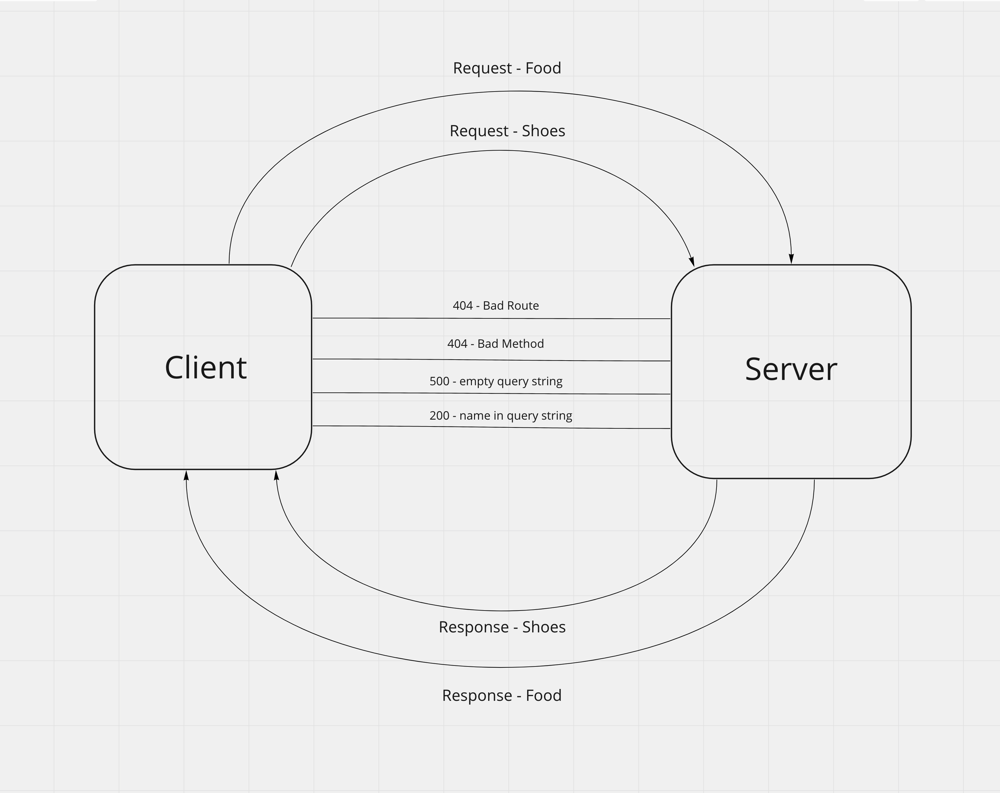

# basic-api-server

```
Repository Name: basic-api-server

Branch Name: main
```

Deplopyed URL: [https://jessi-basic-api-server.herokuapp.com/food](https://jessi-basic-api-server.herokuapp.com/food)

Github Actions: [https://github.com/JessiVelazquez/basic-api-server/actions](https://github.com/JessiVelazquez/basic-api-server/actions)

Pull Request: [https://github.com/JessiVelazquez/basic-api-server/pull/2](https://github.com/JessiVelazquez/basic-api-server/pull/2)

## UML Diagram:



..